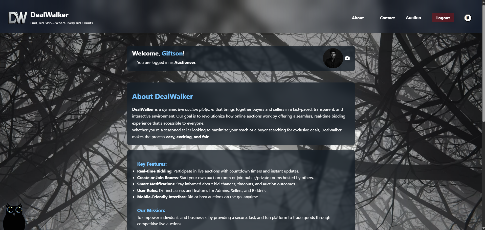
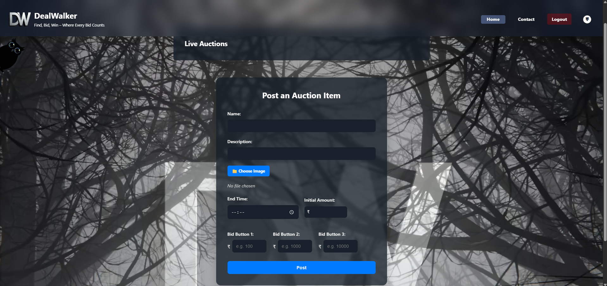
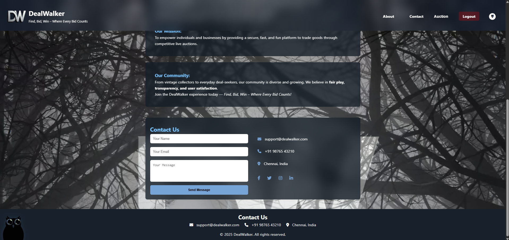

# 🌐 Hello Giftson – Personal Portfolio Website


A modern **developer portfolio website** showcasing my projects, skills, achievements, and professional experience.
Designed with a clean UI, interactive elements, and responsive layout to present my work effectively.

---

# 👨‍💻 About Me

Hi, I'm **M Giftson Raj**
A passionate **Full Stack Developer** and final-year **Computer Science Engineering student**.

I specialize in building **dynamic, responsive, and scalable web applications** using modern technologies.

### 🔹 Tech Stack

* HTML5
* CSS3
* JavaScript
* React
* Flask
* Django
* MongoDB
* MySQL
* Git & GitHub

I have developed **15+ live websites** for clients and projects during my freelancing journey.

---

# ✨ Features

✔ Modern responsive design
✔ Interactive UI animations
✔ Real-time clock display
✔ Project galleries with slider
✔ Skills progress visualization
✔ Contact form with EmailJS integration
✔ Google Maps location embedding
✔ Social media integration
✔ Image modal preview system

---

# 📸 Screenshots

### Home Page

```md

```

### Skills Section

```md

```

### Projects Section

```md

```

### Contact Section

```md

```

---

# 🚀 Projects Highlighted

## 1️⃣ Indian Sign Language Translation Platform

**Tech:** Three.js, Flask, JavaScript

A web platform that converts **English text into Indian Sign Language gestures** using a **3D animated avatar**, helping communication with hearing and speech-impaired individuals.

---

## 2️⃣ DealWalker – Online Auction Platform

**Tech:** Flask, MongoDB, Socket.IO

Features:

* Real-time bidding system
* Secure authentication
* Email verification
* Image storage using MongoDB GridFS
* Live auction updates

---

## 3️⃣ Pneumonia Detection System

**Tech:** Python, Deep Learning, Flask

An **AI-powered healthcare tool** that analyzes chest X-ray images to detect pneumonia using trained deep learning models.

---

# 🏫 Education

**B.E Computer Science and Engineering**
Tagore Engineering College
2022 – 2026

**Higher Secondary Education**
Kendriya Vidyalaya No:1, Kalpakkam
2021 – 2022

---

# 💼 Experience

### Freelance Web Developer — TecLanC Web Solutions

📅 2023 – Present

* Developed **15+ professional websites**
* Built **dynamic full-stack applications**
* Created **AI tools, auction systems, and business platforms**
* Worked directly with clients to deliver custom digital solutions

---

# 🏆 Achievements

* Developed 15+ professional websites
* Built a real-time auction system with Socket.IO
* Created Indian Sign Language translation platform
* Developed AI-based pneumonia detection system
* Active contributor to full-stack projects

---

# 📜 Certifications

* HTML, CSS, JS & Python Essential Training — LinkedIn Learning
* AI Prompt Engineering — Naan Mudhalvan
* Python Full Stack Development Internship — GB Tech Corp
* Code Contest Runner — Symposium

---

# 📬 Contact

📍 Chennai, India
📞 +91 93451 78603
📧 [mgiftsonraj04@gmail.com](mailto:mgiftsonraj04@gmail.com)

### 🌍 Connect With Me

[LinkedIn](https://www.linkedin.com/in/m-giftson-raj-59479a27a/)
[GitHub](https://github.com/MGiftsonRaj40)
[Instagram](https://instagram.com/mgiftsonraj04)

---

# ⚙️ Installation

Clone the repository

```bash
git clone https://github.com/yourusername/portfolio.git
```

Navigate to project folder

```bash
cd portfolio
```

Open in browser

```bash
index.html
```

---

# 📄 License

This project is open-source and available under the **MIT License**.

---

# ⭐ Support

If you like this project, consider giving it a **star ⭐ on GitHub**.

---

💡 If you want, I can also make a **🔥 GitHub Profile-Level README (with animated badges, stats, typing animation, tech icons)** which will make your GitHub profile **look like a senior developer profile.**
